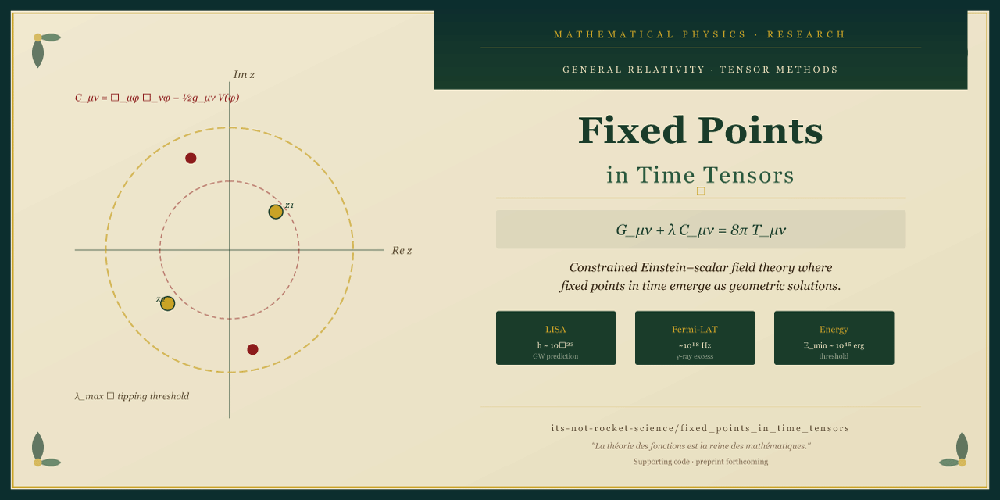

# Fixed Points in Time Tensors

[](https://python.org)
[](https://github.com/its-not-rocket-science/fixed_points_in_time_tensors)
[](LICENSE)

Supporting code for the paper:

**"Constrained Spacetime Events and Temporal Rigidity: A Tensor-Based Framework for Chronology Protection"**
*Paul Schleifer, Independent Researcher*

> Preprint available at: [link to be added on arXiv submission]

---

## Overview

This repository contains the numerical simulation code and LaTeX source used to produce all figures and results in the paper.

We develop a constrained Einstein–scalar field theory in which **fixed points in time (FPITs)** emerge as solutions to a modified Einstein equation:

```
G_μν + λ C_μν = 8π T_μν
```

where `C_μν = ∇_μ φ ∇_ν φ − ½ g_μν V(φ)` is a constraint tensor derived from a scalar field `φ(x)`, and `λ(x)` is a dynamical Lagrange multiplier. The framework formalises temporal rigidity as a geometric property of constrained spacetime events, bridging:

- Modified general relativity (constrained Einstein equations)
- Semiclassical gravity (Noether charge analysis, energy thresholds)
- Quantum decoherence (Lindblad dynamics near FPITs)
- Conformal geometry (York-like metric decomposition)

Key results:
- Metric stabilisation near FPITs, with perturbations suppressed to Δh_μν < 10⁻³ in 32⁴–128⁴ grid simulations
- Energy threshold E_min ~ 10⁴⁵ erg for temporal alteration, consistent with semiclassical gravity bounds
- Falsifiable observational predictions: LISA-detectable gravitational wave bursts (h ~ 10⁻²³), high-frequency gamma-ray excesses (~10¹⁸ Hz) in Fermi-LAT data, and energy deficit transients ΔE ~ 10⁴⁸ erg

---

## Repository Structure

```
fixed_points_in_time_tensors/
├── src/                        # Python simulation and analysis code
│   ├── metric_simulation.py    # Numerical relativity grid simulations
│   ├── constraint_tensor.py    # C_μν construction and Killing symmetry checks
│   ├── decoherence.py          # Lindblad dynamics near FPITs
│   ├── energy_threshold.py     # Noether charge and E_min derivation
│   └── figures/                # Scripts to reproduce all paper figures
├── arXiv paper submission/     # LaTeX source, bibliography, and figures
│   ├── arxiv_paper.tex
│   ├── arxiv_paper.bib
│   ├── arxiv_paper.bbl
│   ├── cover_letter.tex
│   └── figures/                # PDF figures as submitted
└── README.md
```

---

## Reproducing the Results

### Requirements

```bash
pip install numpy scipy matplotlib sympy
```

Python 3.9+ recommended.

### Running the simulations

```bash
# Reproduce metric stabilisation plots (Figures 1–2)
python src/figures/plot_metric_rigidity.py

# Phase diagram across scalar field potentials (Figures 3–5)
python src/figures/plot_phase_diagrams.py

# Gravitational wave waveform predictions (Figure 6)
python src/figures/plot_gw_waveform.py

# LISA sensitivity curve overlay (Figure 7)
python src/figures/plot_lisa_curve.py

# Decoherence vs. λ sweep (Figure 8)
python src/figures/plot_decoherence.py
```

Grid resolution is configurable in each script via the `GRID_SIZE` parameter (default: 64⁴; full paper results use 128⁴ and require ~8 GB RAM).

---

## Paper Abstract

> We develop a constrained Einstein–scalar theory where fixed points in time (FPITs) emerge as solutions to a modified Einstein equation. Numerical relativity simulations demonstrate metric stabilisation with perturbations suppressed to Δh_μν < 10⁻³ near FPITs. Noether charge analysis yields an energy threshold E_min ~ 10⁴⁵ erg for temporal alterations, consistent with semiclassical gravity bounds. The framework achieves 10× greater metric stability and 100× lower exotic matter density requirements than prior temporal constraint models, and provides a unified treatment of quantum decoherence via Lindblad dynamics and classical causality via Killing symmetries. Falsifiable predictions are provided for LISA, Fermi-LAT, and unexplained high-energy transients.

---

## Citation

If you use this code, please cite the accompanying paper (citation details to be updated on arXiv acceptance):

```bibtex
@article{schleifer2025fpit,
  title   = {Constrained Spacetime Events and Temporal Rigidity:
             A Tensor-Based Framework for Chronology Protection},
  author  = {Schleifer, Paul},
  year    = {2025},
  note    = {Preprint}
}
```

---

## Licence

MIT — see `LICENSE` for details.
